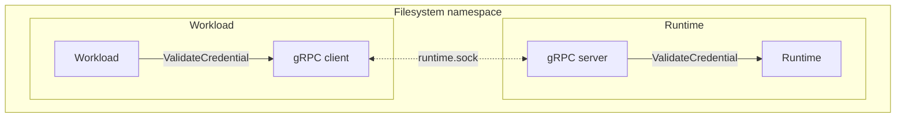

# IAM runtime

Authors:

* John Schaeffer <jschaeffer@equinix.com>

## Notational conventions

## Terminology

| Term        | Definition                                                                                                    |
|-------------|---------------------------------------------------------------------------------------------------------------|
| Service     | A named group of RPC definitions that must be implemented together.                                           |
| Runtime     | A gRPC server that provides one or more IAM runtime services.                                                 |
| Workload    | A unit of work, such as a container, that relies on the IAM runtime to function.                              |
| Environment | A collection of shared services, standards, and conventions that define how IAM is implemented for workloads. |

## Objective

To define a runtime interface that will enable application authors to perform IAM-related functions in a language-independent, pluggable fashion.

### Goals

The IAM runtime will:

* Enable application authors to write applications that are secure by default
* Enable greater flexibility in application deployment and environment choice
* Define gRPC services for authentication, authorization, and audit (AAA) functionality

### Non-goals

The IAM runtime will not:

* Replace existing IAM logic in a deployment environment
* Define runtime implementations for all IAM combinations within a deployment environment
* Provide language-specific bindings outside of gRPC service definitions and, optionally, generated code

## Overview

This specification defines an interface and minimum operational requirements for a runtime that provides IAM-related functionality in a given environment.

### Architecture

The primary focus of this specification is the communication between a workload and a runtime implementation. The specification thus defines the gRPC interfaces a runtime must expose, as well as optional guidance on how to deploy the runtime itself. The following diagram illustrates how a workload process communicates with a runtime process in the same filesystem namespace to execute a function, `ValidateCredential`.

#### Figure 1: High-level runtime architecture example



While this example shows only a single operation being called, a runtime MUST implement every REQUIRED operation for a given service and SHOULD provide implementations for all services defined in this spec.

### Client and server behavior

This section describes client (workload) and server (runtime) behavior for IAM runtime implementations.

#### Transport

The IAM runtime MUST be reachable using a Unix Domain Socket. Network protocols such as TCP are not supported.

#### Locating the runtime

Clients SHOULD be configured in advance with the location of a runtime instance. Runtime implementations are expected to be deployed alongside workloads, rather than as shared services in a deployment environment. As a result, each workload in an environment SHOULD be associated with its own runtime instance.

#### Authentication

This specification does not define any particular method for authenticating the client.

### IAM runtime interface

This section defines the gRPC services an IAM runtime SHOULD implement. An IAM runtime MUST implement at least one of these interfaces to be considered a compliant runtime.

#### Authentication service

The Authentication service manages verification of credentials provided to applications and is defined as follows:

```proto
service Authentication { 
  rpc ValidateCredential(ValidateCredentialRequest)
    returns (ValidateCredentialResponse) {}
}
```

##### `ValidateCredential`

```proto
message ValidateCredentialRequest {
  // credential is the literal credential for a subject (such as a bearer token) passed to the
  // application with no transformations applied.
  string credential = 1;
}

message ValidateCredentialResponse {
  enum Result {
    RESULT_VALID = 0;
    RESULT_INVALID = 1;
  }

  // Result represents the decision made about whether the credential is valid. If it is valid,
  // this field should be set to RESULT_VALID and subject should be set. Otherwise, this field
  // should be set to RESULT_INVALID.
  Result result = 1;

  // Subject represents the actor the given token identifies. If the given credential is not valid,
  // (i.e., result is set to RESULT_INVALID), this field's value is undefined.
  Subject subject = 2;
}
```

`ValidateCredential` is a REQUIRED operation which verifies that the credential provided to the application maps to a known subject, such as a JWT with a valid signature and expiry in the future. If the credential is valid, implementations MUST respond with `result` set to `RESULT_VALID` and `subject` populated accordingly. Otherwise, implementations MUST respond with `result` set to `RESULT_INVALID`.

#### Authorization service

The Authorization service manages policy enforcement for applications and is defined as follows:

```proto
service Authorization {
  rpc CheckAccess(CheckAccessRequest)
    returns (CheckAccessResponse) {}
    
  rpc CreateRelationships(CreateRelationshipsRequest)
    returns (CreateRelationshipsResponse) {}

  rpc DeleteRelationships(DeleteRelationshipsRequest)
    returns (DeleteRelationshipsResponse) {}
}
```

Common data types are defined as follows:

```proto
message Relationship {
  // relation is the name of the relationship between two resources.
  string relation = 1;
  // subject_id is the ID of the subject (i.e., "other end") of the relationship.
  string subject_id = 2;
}
```

##### `CheckAccess`

```proto
message AccessRequestAction {
  // action is the name of the action the subject is attempting to perform an action on.
  string action = 1;
  // resource_id is the ID of the resource the subject is attempting to perform an action on.
  string resource_id = 2;
}

message CheckAccessRequest {
  // credential is the literal credential for a subject (such as a bearer token) passed to the
  // application with no transformations applied.
  string credential = 1;
  // actions is the set of all actions to check access for. All of these must be allowed for the
  // request itself to be allowed.
  repeated AccessRequestAction actions = 2;
}

message CheckAccessResponse {
  enum Result {
    RESULT_ALLOWED = 0;
    RESULT_DENIED = 1;
  }

  Result result = 1;
}
```

`CheckAccess` is a REQUIRED operation which checks that the subject identified by the given credential has access to perform the given actions on the given resources. If all given actions are allowed, runtime implementations MUST respond with `result` set to `RESULT_ALLOWED`. If any action is not allowed, runtime implementations MUST respond with `result` set to `RESULT_DENIED`.

In the event that the given credential is not valid, or any action or resource is not valid for the deployment environment, implementations MUST respond with gRPC status 3 (`INVALID_ARGUMENT`).

#### `CreateRelationships`

```proto
message CreateRelationshipsRequest {
  // resource_id is the ID of the resource to create relationships for.
  string resource_id = 1;
  // relationships is the set of relationships to create.
  repeated Relationship relationships = 2;
}

message CreateRelationshipsResponse {
}
```

`CreateRelationships` is an OPTIONAL operation which creates relationships between a resource and some other set of resources for policy enforcement. If any relationships are not valid, runtime implementations MUST respond with gRPC status 3 (INVALID_ARGUMENT).

#### `DeleteRelationships`

```proto
message DeleteRelationshipsRequest {
  // resource_id is the ID of the resource to delete relationships for.
  string resource_id = 1;
  // relationships is the set of relationships to delete.
  repeated Relationship relationships = 2;
}

message DeleteRelationshipsResponse {
}
```

`DeleteRelationships` is an OPTIONAL operation which deletes relationships between a resource and some other set of resources for policy enforcement. If any relationships are not valid, runtime implementations MUST respond with gRPC status 3 (INVALID_ARGUMENT).
